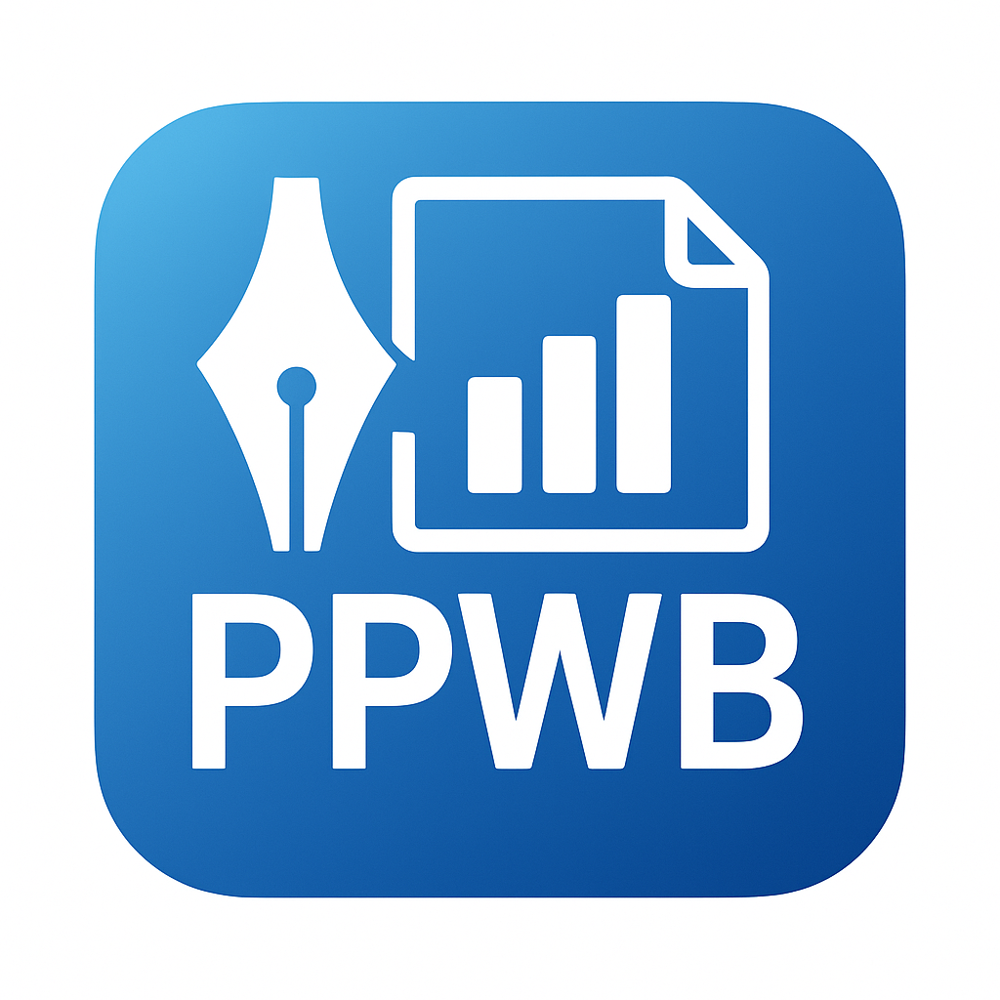
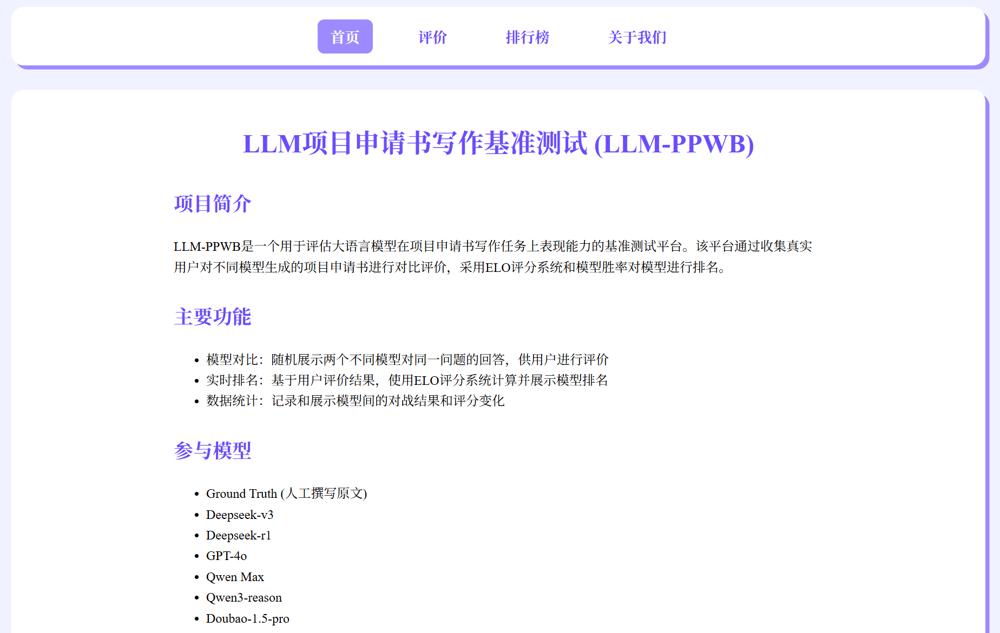
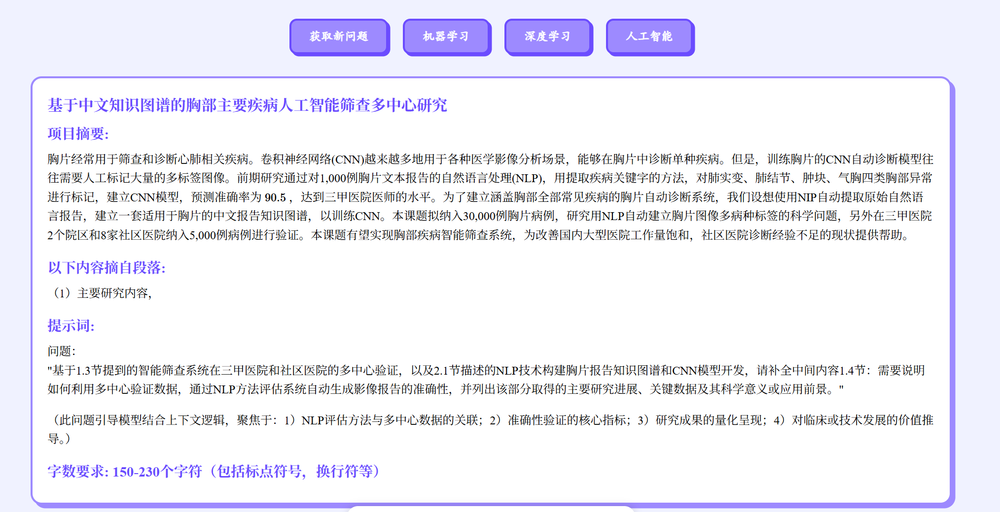
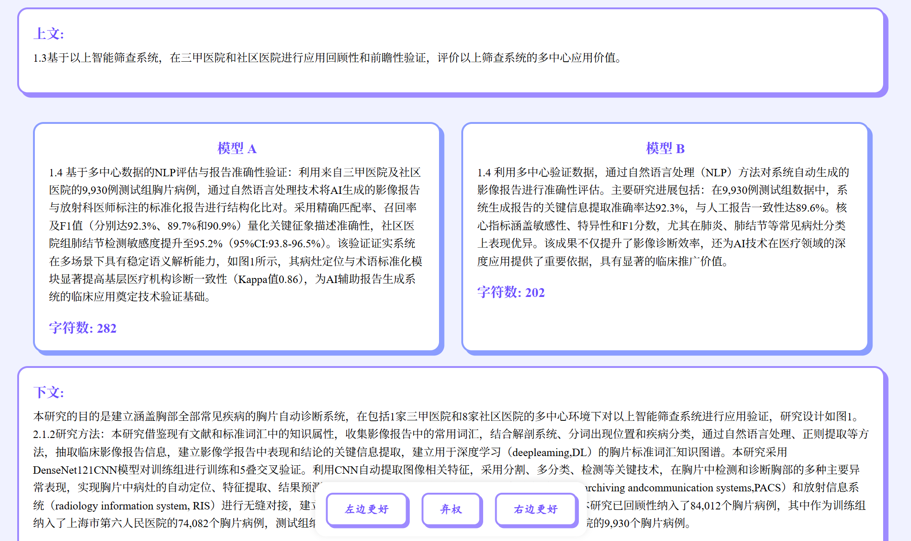
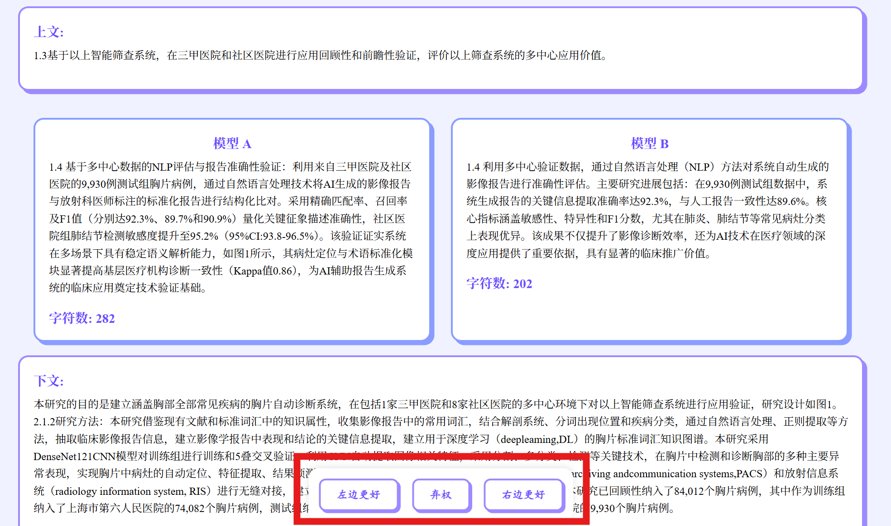
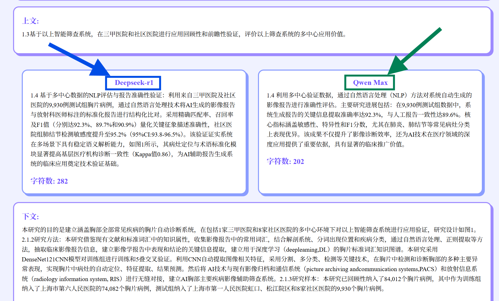
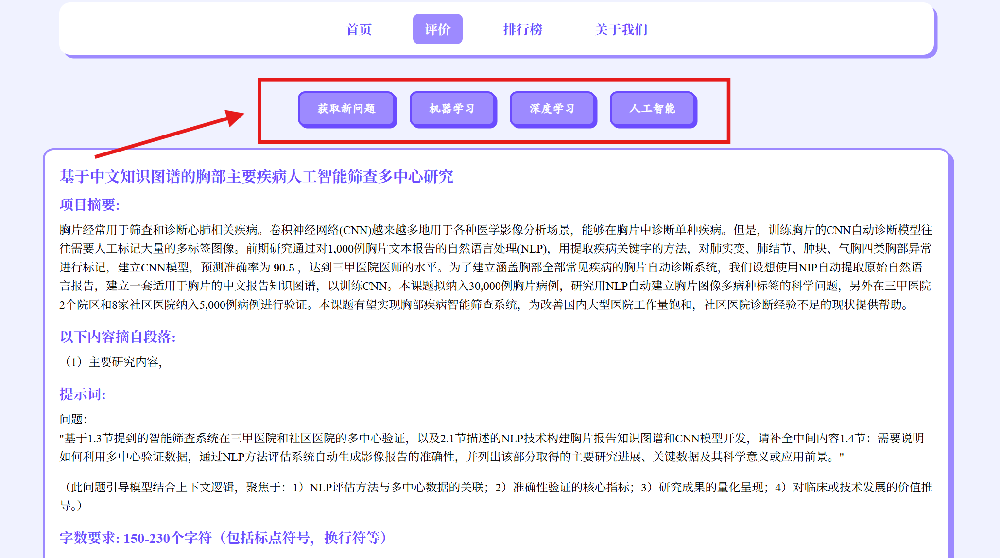

# LLM项目申请书写作基准测试 (LLM-PPWB)

  <a href="README.md">English</a> | <a href="README_zh.md">中文</a>

## 项目简介

**LLM-PPWB是一个用于评估大语言模型在项目申请书写作任务上表现能力的基准测试平台。**该平台通过收集真实用户对不同模型生成的项目申请书进行对比评价，采用ELO评分系统和模型胜率对模型进行排名。

## 项目目标

我们致力于通过收集大量用户评价数据，建立客观的模型评估体系，为项目申请书写作任务中的模型选择提供参考依据。在收集到足够多的数据之后，我们会对后台数据整理成开源数据集。

## 主要功能

- 模型对比：随机展示两个不同模型对同一问题的回答，供用户进行评价
- 实时排名：基于用户评价结果，使用ELO评分系统计算并展示模型排名
- 数据统计：记录和展示模型间的对战结果和评分变化

## 参与模型

- Ground Truth (人工撰写原文)
- Deepseek-v3
- Deepseek-r1
- GPT-4o
- Qwen Max
- Qwen3-reason
- Doubao-1.5-pro

## 使用方法

### benchmark网站链接

[LLM项目申请书写作基准测试](http://8.140.232.135:54321/)

### 测评功能

1. 点击"开始评价"进入评价页面，可选自己擅长的领域
<<<<<<< Updated upstream
2. 阅读项目背景、文章上下文和两个模型的回答
3. 选择您认为更好的模型回答
4. 查看匿名大模型名称
5. 点击"获取新问题"或领域名称按钮获取新的评测

### 排行榜功能

1. 点击导航栏"排行榜"进入排行榜页面
2. 选择你想看的排行方式和数据

=======

   

2. 阅读项目背景、文章上下文和两个模型的回答

   

   

3. 选择您认为更好的模型回答

   

4. 查看匿名大模型名称

   

5. 点击"获取新问题"或领域名称按钮获取新的评测

   

### 排行榜功能

1. 点击导航栏"排行榜"进入排行榜页面

   

2. 选择你想看的排行方式和数据

   

>>>>>>> Stashed changes
## 更新日志

[2025.05.05]🎯📢PPWB正式上线：[LLM项目申请书写作基准测试](http://8.140.232.135:54321/)。

[2025.05.01]🎯📢增添Qwen3-reason、Doubao-1.5-pro测试模型。

[2025.04.24]🎯📢PPWB启动。

## 致谢

感谢国家自然科学基金，感谢所有国家自然科学基金项目负责人、项目参与人和依托单位。
